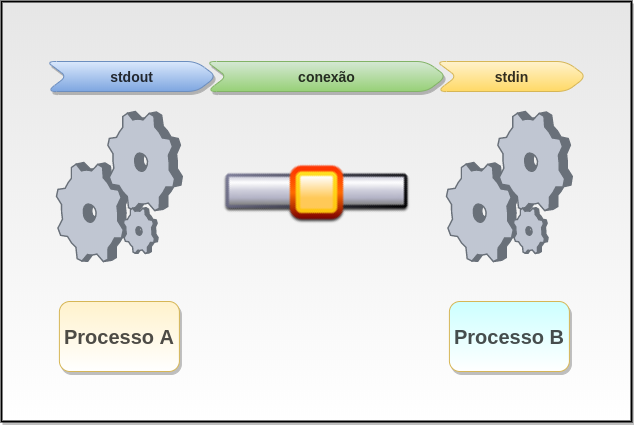
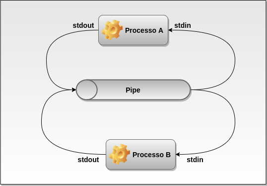
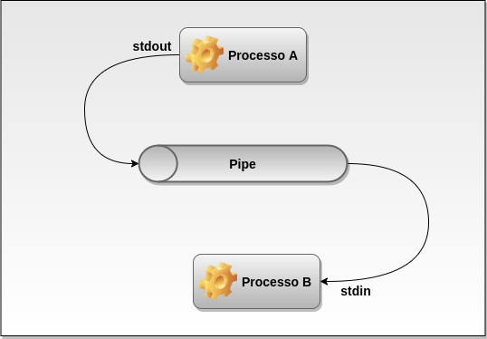

<p align="center">
  
</p>


# _Pipes_

## Sumário
* [Introdução](#Introdução)
* [Criando Pipes](#criando-pipes)
* [Pipes após um fork](#pipes-após-um-fork)
* [Implementação](#Implementação)
* [launch_processes.c](#launch_processesc)
* [button_process.c](#button_processc)
* [led_process.c](#led_processc)
* [Compilando, Executando e Matando os processos](#compilando-executando-e-matando-os-processos)
* [Compilando](#Compilando)
* [Executando](#Executando)
* [Matando os processos](#matando-os-processos)
* [Conclusão](#Conclusão)
* [Referências](#Referências)

## Introdução
_Pipes_ é um recurso IPC empregado para conectar a saída de um processo a entrada de um outro processo. _Pipes_ é largamente utilizado pelo CLI(_Command Line Interface_), como por exemplo em uma consulta simples listando todos os arquivos de um respectivo diretório e filtrando por arquivos de extensão \*.txt, normalmente usamos _ls_ seguido de _grep_, como demonstrado no comando abaixo:
```bash
$ ls | grep *.txt
```
O comando descrito transfere os dados de saída gerado pelo comando _ls_ que seriam apresentados no _stdout_  e são passados como argumentos de entrada(_stdin_) para o comando _grep_ que filtra o resultado e apresenta os arquivos que possuem a extensão. Em outras palavras o _Pipes_ permite que o _stdout_ do [Processo A] se conecte com o _stdin_ do [Processo B].

<p align="center">
  
</p>

O fluxo da conexão obedece a seguinte ordem o _stdout_ se conecta com o _stdin_, porém fluxo contrário não é permitido, para isso é necessário estabelecer um conexão do processo B para o A.

### Criando _Pipes_

Para criar _pipes_ é utilizado a _system call_ 
```c
#include <unistd.h>

int pipe(int filedes[2]);
```

### _Pipes_ após um _fork_
O _fork_ é tem a característica de clonar todo o processo, e devido a isso tudo que for aberto pelo processo pai vai ser refletido no processo filho, sendo assim, se um _pipe_ for aberto no processo pai o processo filho também irá herdar o _pipe_, a figura a seguir pode representar essa situação:

<p align="center">
  
</p>

Para garantir que o processo pai se comunicará com o processo filho na forma correta, é necessário fechar os descritores, de modo que o _stdout_ do pai fique conectado ao _stdin_ do filho, a imagem a seguir representa essa configuração:

<p align="center">
  
</p>

## Implementação
Para exemplificar _Pipes_ foi criado uma aplicação no estilo cliente-servidor, onde o processo que controla o botão é responsável pela requisição da mudança de estado do _LED_ comportando-se como cliente, e o processo que controla o _LED_ é responsável pelo o controle do pino físico, ou seja, a alteração do estado efetivo do _LED_ comportando-se como servidor da aplicação; A aplicação é composta por três executáveis descritos a seguir:
* _launch_processes_ - processo responsável por lançar os processos _button_process_ e _led_process_ através da combinação _fork_ e _exec_
* _button_process_ - processo responsável por ler o GPIO em modo de leitura da Raspberry Pi e enviar o estado via _Pipe_ para o processo _led_process_
* _led_process_ - processo reponsável por controlar o GPIO em modo de escrita da Rasoberry e alterar o estado do pino de acordo com o _input_ fornecido pelo processo _button_process_.
### launch_processes.c
Primeiro são declaradas variáveis para a criação do _pipe_ e duas variáveis para identificar quem é o _stdout_ e o _stdin_, e é chamada a _system call_ de criação do _pipe_
```c
int file_pipes[2];
int fd_read;
int fd_write;
char args[BUFSIZ + 1];

int ret = pipe(file_pipes);
```
Após a criação é feita a atribuição para as variáveis representando a função de cada indice, onde 0 representa o canal de leitura e 1 o canal de escrita
```c
fd_read = file_pipes[0];
fd_write = file_pipes[1];
```
Para que o _fork_ seja realizado é necessário verificar se o _pipe_ foi criado com sucesso, caso o retorno seja igual a zero, o fluxo continua
```c
if(ret == 0){
```
Com o _pipe_ criado, clonamos o processo e no processo filho fechamos o descritor referente ao de leitura, e passamos como argumento o descritor de escrita para o processo _button_process_
```c
int fork_res = fork();
if(fork_res == 0){
    close(fd_read);
    memset(args, 0, sizeof(args));
    sprintf(args, "%d", fd_write);
    (void)execl("button_process", "button_process", args, (char *)0);            
    exit(EXIT_FAILURE);
```
De volta ao processo pai verificamos se o _fork_ anterior foi executado com sucesso, caso sim é iniciada uma nova cópia, porém dessa vez o descritor de escrita é fechado e passamos o descritor de leitura como argumento para o processo _led_process_
```c
}else if(fork_res > 0){
    fork_res = fork();
    if(fork_res == 0){
        close(fd_write);
        memset(args, 0, sizeof(args));
        sprintf(args, "%d", fd_read);
        (void)execl("led_process", "led_process", args, (char *)0);
        exit(EXIT_FAILURE);
    }
}    
```
Por fim fechamos os descritores do processo pai
```c

close(file_pipes[0]);
close(file_pipes[1]);  
```

### button_process.c

Criamos o descritor do _button_ 

```c
static Button_t button = {
    .gpio.pin = 7,
    .gpio.eMode = eModeInput,
    .ePullMode = ePullModePullUp,
    .eIntEdge = eIntEdgeFalling,
    .cb = NULL
};
```
Declaramos um buffer para formatar a mensagem de envio, e declaramos uma variável para receber o descritor recebido via argumento
```c
char data[64];
char buffer[BUFSIZ + 1];
int fd;
int state = 0;
```
Configuramos o pino, passando o descritor como argumento
```c    
if(Button_init(&button))
    return EXIT_FAILURE;
```
Limpamos o buffer e copiamos o valor de descritor para o buffer,e convertemos para int para o programa poder usá-la
```c
memset(buffer, 0, sizeof(buffer));
sscanf(argv[1], "%d", &fd);
```
O loop a seguir aguarda que o botão seja pressionado para que a variável *state* seja alterada, se estiver em 0 vai para 1 e vice-versa
```c 
while(1)
{
    if(!Button_read(&button)){
        usleep(_1ms * 40);
        while(!Button_read(&button));
        usleep(_1ms * 40);
        state ^= 0x01;
        break;
    }else{
        usleep( _1ms );
    }
}   
        
```
Assim que o botão for pressionado, inicia-se a escrita no _pipe_ como o novo estado, em seguida é chamado a _system call write_ para enviar a mensagem através do _pipe_
```c
memset(data, 0, sizeof(data));
snprintf(data, sizeof(data), "state = %d\n", state);
write(fd, data, strlen(data));                
usleep(500 * _1ms);
```
Fechamos o descritor de escrita
```c
close(fd);
```

### led_process.c
O processo de configuração se assemelha ao do processo de botão
```c 
char buffer[BUFSIZ + 1];
int fd;   
int state_cur;
int state_old;

LED_t led =
{
    .gpio.pin = 0,
    .gpio.eMode = eModeOutput
};
```
Aplica a inicialização do LED de acordo com o descritor, e recupera o valor do descritor de leitura do _pipe_
```c
if (LED_init(&led))
    return EXIT_FAILURE;

sscanf(argv[1], "%d", &fd);
```
Realiza a leitura do _pipe_ via _polling_ para verificar se houve alteração do estado, se houove atualiza a variável de estado e aplica o novo estado ao LED
```c
memset(buffer, 0, sizeof(buffer));
read(fd, buffer, BUFSIZ);
sscanf(buffer, "state = %d", &state_cur);        

if (state_cur != state_old)
{

    state_old = state_cur;
    LED_set(&led, (eState_t)state_cur);
}
usleep(1);    
```
Por fim fechamos o descritor de leitura
```c    
close(fd);
```

Para o código fonte completo clique [aqui](src)

## Compilando, Executando e Matando os processos
Para compilar e testar o projeto é necessário instalar a biblioteca de [hardware](https://github.com/NakedSolidSnake/Raspberry_lib_hardware) necessária para resolver as dependências de configuração de GPIO da Raspberry Pi.

### Compilando
Para compilar o execute os comandos abaixo
```bash
$ git clone https://github.com/NakedSolidSnake/Raspberry_IPC_Pipe
$ cd Raspberry_IPC_Pipe
$ mkdir build && cd build
$ cmake ..
$ make
```
### Executando
Para executar a aplicação execute o processo _*launch_processes*_ para lançar os processos *button_process* e *led_process*
```bash
$ cd bin
$ ./launch_processes
```
### Matando os processos
Para matar os processos criados execute o script kill_process.sh
```bash
$ cd bin
$ ./kill_process.sh
```

## Conclusão
_Pipe_ é um IPC muito utilizado no shell, porém como opção de uso de comunicação entre processos que possuem tempo de vida indeterminado não muito viável, por não permitir o fluxo de dados de forma bidirecional, e pela dificuldade de manter os handlers de leitura e escrita.
## Referências
* [Linux Programming Interface](https://www.amazon.com.br/dp/B004OEJMZM/ref=dp-kindle-redirect?_encoding=UTF8&btkr=1)
* [fork e exec](https://github.com/NakedSolidSnake/Raspberry_fork_exec)
* [lib hardware](https://github.com/NakedSolidSnake/Raspberry_lib_hardware)
